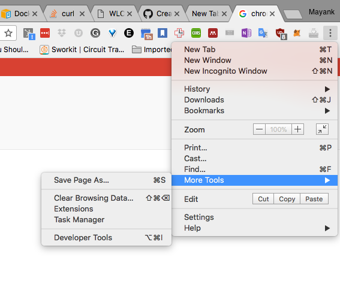
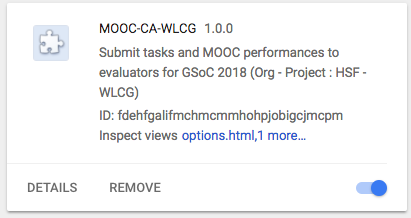
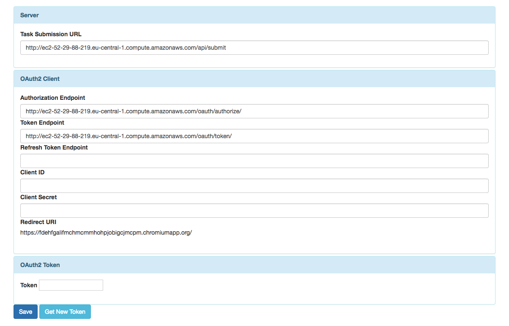
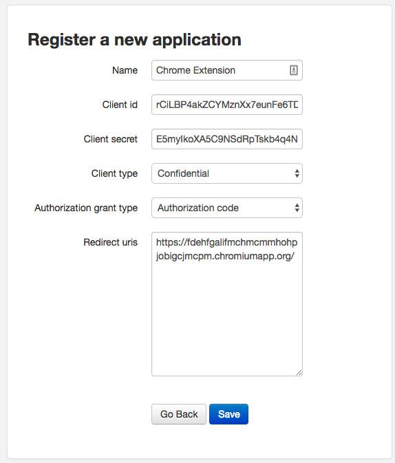
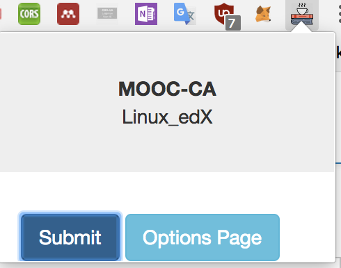

# Introduction

## Requirements
- Google Chrome web browser 
- Approved Membership of [WLCG Lightweight Site Google Group](https://groups.google.com/forum/#!forum/wlcg-lightweight-sites) (to be able to access the chrome extension)
# Getting started
## Step 1: Download and install chrome extension
Assuming you are using Google Chrome and are already a member of the WLCG Lightweight Sites google group, you should be able to download and install the MOOC-CA chrome extension from the Chrome Web Store
Link : [MOOC-CA chrome web store](https://chrome.google.com/webstore/detail/mooc-ca-wlcg/fdehfgalifmchmcmmhohpjobigcjmcpm/related?hl=en-US)

## Step 2: Configuring the Extension
1. Open the [Chrome Extension Page](chrome://extensions/)

2. Find MOOC-CA-WLCG in the list of extensions

3. Click on **Details** to open the detailed view for the extension

4. Scroll down and click on the pop-out window button next to **Extension options**

5. In the Server section, update the **Task Submission URL**:

| Parameter | Value  |
| --------- |:-----: |
| Task Submission URL| http://ec2-52-29-88-219.eu-central-1.compute.amazonaws.com/evaluator/api/submit |

6. In the OAuth2 Client section, update the **Authorization Endpoint** and **Token Endpoint** as follows:

| Parameter | Value  |
| --------- |:-----: |
| Authorization Endpoint | http://ec2-52-29-88-219.eu-central-1.compute.amazonaws.com/oauth/authorize/ |
| Token Endpoint| http://ec2-52-29-88-219.eu-central-1.compute.amazonaws.com/oauth/token/ |

**Attention** : Please make sure that the url's end in a backslack ( / ), else the extension will fail to contact the server endpoints.

7. Copy the **Redirect URI** in the OAuth2 Client section

8. Click the Save button at the bottom left of the screen.

## Step 3: Creating a User/Applicant account on the server

- Fill out the [registration form](http://ec2-52-29-88-219.eu-central-1.compute.amazonaws.com/accounts/register/)
- You will receive an activation email from wlcg.lightweight.sites@gmail.com with the activation link.

## Step 4: Creating an OAuth2 application for the chrome extension
1. Once you have activated your account, you can [login](http://ec2-52-29-88-219.eu-central-1.compute.amazonaws.com/accounts/login/). 

2. From the profile view, in the OAuth2 Apps section, click on [Register New App](http://ec2-52-29-88-219.eu-central-1.compute.amazonaws.com/oauth/applications/register/)

3.  Use the following guidelines to fill up the form

| Parameter| Value |
|----------|-------|
| Name     | Any name you prefer |
| Client Type|  Confidential |
| Authorization grant type | Authorization Code|
| Redirect uris | Paste the value of Redirect uri mentioned in Step 2.7. Please make sure you do not forget to include the trailing backslash ( / ) in the url.

4. Copy the values of Client ID and Client Secret presented on the 'Register a New Application' form. Temporarily paste them in a text editor.

## Step 5: Configuring Chrome Client as the OAuth2 client

1. Open the options page for MOOC-CA chrome extension. [Steps 2.1 - 2.4]
2. In the OAuth2 Client section, fill in the **Client ID** and **Client Secret** fields with the respective information obtained during Step 3.4
3. Click the Save button at the bottom left side of the screen

## Step 6: Getting an access Token

1. Open the options page for MOOC-CA chrome extension. [Steps 2.1 - 2.4]
2. Click on **Get New Token** to start the Authorization Code flow with the MOOC-CA Server. You'd be asked to log-in (using your user credentials on the MOOC-CA server) and authorize the chrome extension to make submissions on your behalf.

# Submitting Tasks

## Plugin Activation
The extension only gets activated on the results/progress pages of the following courses.

1. [Introduction To Kuberntes](https://courses.edx.org/courses/course-v1:LinuxFoundationX+LFS158x+2T2017/progress) 
2. [Fundamentals of Containers, Kubernetes and Red Hat OpenShift](https://courses.edx.org/courses/course-v1:RedHat+DO081x+2T2017/progress)
3. [Introduction to Linux](https://courses.edx.org/courses/course-v1:LinuxFoundationX+LFS101x+1T2017/progress)
4. [Ansible Essentials - Simplicity in Automation](https://www.udemy.com/ansible-essentials-simplicity-in-automation/learn/v4/content)
5. [Puppet Training](https://learn.puppet.com/user/learning/enrollments?type=completed)

## Submission
1. Open the submission URL's from the link above for the course you wish to submit
2. The coffee icon of the MOOC-CA extension would get activated. If not, refresh the page.

3. Click on the coffee icon for the MOOC-CA extension and click the Submit button
4. You should see the 'Submitted!!' message on successful submission. If you want, you can take a look at the submission by logging into the MOOC-CA server and then clicking on the submitted tasks under the **Submitted Tasks** section.

## Youtube Video
